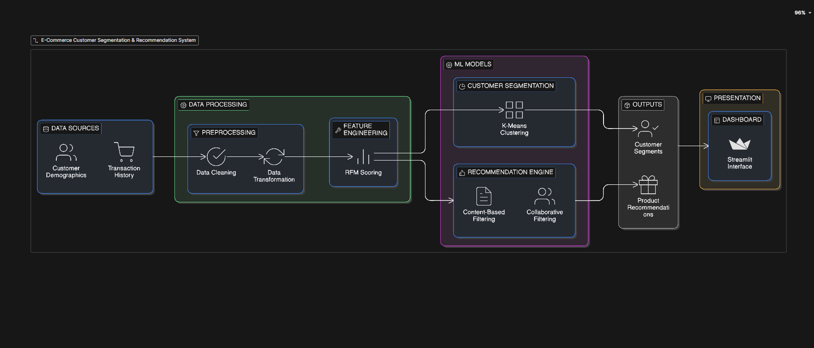

# Personalized Recommendation Dashboard for E-commerce

A smart dashboard for e-commerce business owners to:

- Track most profitable and loss-making products
- View recommended products related to each item for better cross-selling
- Gain quick, actionable insights to improve sales and inventory decisions



---

## Dataset

The `data/` directory contains a **large, realistic synthetic e-commerce dataset** that is ready to use out-of-the-box. It is also fully reproducible and can be scaled to any size using the generation script.

### Files

| File | Rows | Size | Description |
|---|---|---|---|
| `data/products.csv` | 500 | ~57 KB | Product catalogue with pricing, stock, and ratings |
| `data/users.csv` | 2 000 | ~207 KB | Customer profiles with demographics and location |
| `data/orders.csv` | 10 000 | ~889 KB | Order / transaction records with line items |
| `data/reviews.csv` | 8 000 | ~680 KB | Product reviews with rating and review text |

### Schema

#### `products.csv`
| Column | Type | Description |
|---|---|---|
| `product_id` | string | Unique product identifier (e.g. `P00001`) |
| `product_name` | string | Full product name including brand |
| `brand` | string | Brand name |
| `category` | string | Top-level category (8 categories) |
| `base_item` | string | Generic item type within the category |
| `cost_price` | float | Wholesale / cost price (USD) |
| `selling_price` | float | Listed retail price (USD) |
| `discount_pct` | int | Discount percentage (0–30 %) |
| `discounted_price` | float | Final price after discount |
| `stock_quantity` | int | Units currently in stock |
| `avg_rating` | float | Average customer rating (1–5) |
| `reviews_count` | int | Total number of reviews |
| `is_active` | bool | Whether the product is currently listed |

#### `users.csv`
| Column | Type | Description |
|---|---|---|
| `user_id` | string | Unique user identifier (e.g. `U000001`) |
| `first_name` | string | Customer first name |
| `last_name` | string | Customer last name |
| `email` | string | Anonymised email address |
| `age` | int | Age in years |
| `gender` | string | Gender identity |
| `country` | string | Country of residence (15 countries) |
| `city` | string | City of residence |
| `registration_date` | date | Account creation date |
| `last_active_date` | date | Most recent activity date |
| `is_premium` | bool | Premium / loyalty member flag |

#### `orders.csv`
| Column | Type | Description |
|---|---|---|
| `order_id` | string | Unique order identifier (e.g. `O0000001`) |
| `user_id` | string | Customer who placed the order |
| `order_date` | datetime | Date and time the order was placed |
| `product_ids` | string | Pipe-separated `product_id×qty` pairs (e.g. `P00186×3\|P00031×3`) |
| `num_items` | int | Number of distinct products in the order |
| `order_total` | float | Total order value (USD) |
| `payment_method` | string | Payment method used |
| `status` | string | Order status (Delivered / Shipped / Processing / Cancelled / Returned) |
| `delivery_days` | int | Days from order placement to delivery (null if not dispatched) |

#### `reviews.csv`
| Column | Type | Description |
|---|---|---|
| `review_id` | string | Unique review identifier (e.g. `R0000001`) |
| `product_id` | string | Product being reviewed |
| `user_id` | string | Customer who wrote the review |
| `rating` | int | Star rating (1–5) |
| `review_text` | string | Free-text review body |
| `helpful_votes` | int | Number of helpful votes from other users |
| `verified_purchase` | bool | Whether the reviewer purchased the item |
| `review_date` | date | Date the review was submitted |

---

## Generating a Larger Dataset

Use the bundled script to regenerate the data at any scale:

```bash
# Install Python 3.8+ (no third-party packages required — stdlib only)

# Default sizes: 500 products, 2 000 users, 10 000 orders, 8 000 reviews
python scripts/generate_dataset.py

# Custom sizes (e.g. 1 million orders)
python scripts/generate_dataset.py \
    --products 5000 \
    --users    50000 \
    --orders   1000000 \
    --reviews  800000

# Write to a different directory
python scripts/generate_dataset.py --out-dir /path/to/output

# See all options
python scripts/generate_dataset.py --help
```

The script uses a fixed random seed (`--seed 42`) so the output is fully reproducible.

---

## Real-World Public Datasets

For production use-cases or benchmarking you can supplement or replace the synthetic data with these freely available real-world datasets:

| Dataset | Records | Source |
|---|---|---|
| **Brazilian E-Commerce (Olist)** | ~100 k orders, 9 linked tables | [Kaggle](https://www.kaggle.com/datasets/olistbr/brazilian-ecommerce) |
| **Amazon Product Reviews (UCSD)** | Millions of reviews, 29 categories | [UCSD](https://cseweb.ucsd.edu/~jmcauley/datasets/amazon_v2/) |
| **Online Retail II (UCI)** | ~1 M transactions, UK retailer 2009-2011 | [UCI ML Repository](https://archive.ics.uci.edu/dataset/502/online+retail+ii) |
| **Instacart Market Basket** | 3 M grocery orders from 200 k users | [Kaggle](https://www.kaggle.com/competitions/instacart-market-basket-analysis/data) |
| **Retail Rocket E-Commerce** | 2.7 M events (views, add-to-cart, purchases) | [Kaggle](https://www.kaggle.com/datasets/retailrocket/ecommerce-dataset) |

Download any of these datasets and place the CSV/JSON files in the `data/` directory to use them with the dashboard.

---

## License

This project is licensed under the terms of the [LICENSE](LICENSE) file.
